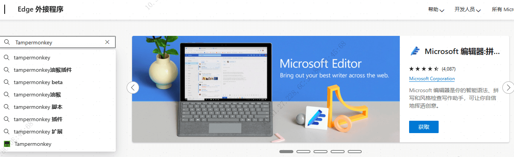
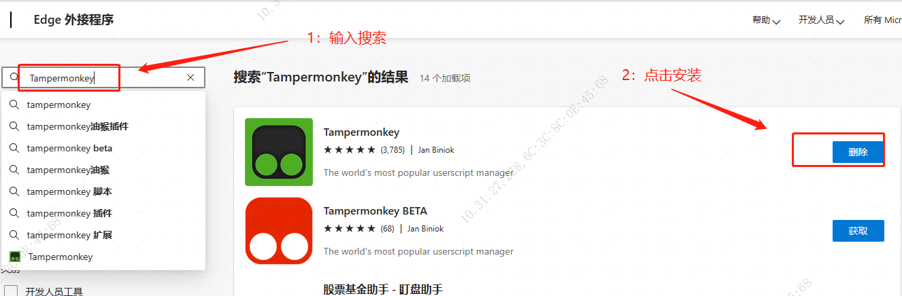

# Tampermonkey

油猴脚本插件的安装教程

## Chrome 浏览器插件安装教程

国内访问 Chrome 应用市场有限制，需要有不知名手段（梯子翻墙）进行访问。

👉[打开Chrome 应用市场](https://chrome.google.com/webstore/category/extensions) 

输入 Tampermonkey 搜索，然后点击扩展程序进入扩展详情页进行安装。

## Edge 浏览器插件安装教程

国内访问 Edge 应用市场没有限制，可以直接访问

👉[打开Edge 应用市场](https://microsoftedge.microsoft.com/addons/Microsoft-Edge-Extensions-Home?hl=zh-CN) 

输入 Tampermonkey 搜索，然后点击扩展程序进入扩展详情页进行安装。

