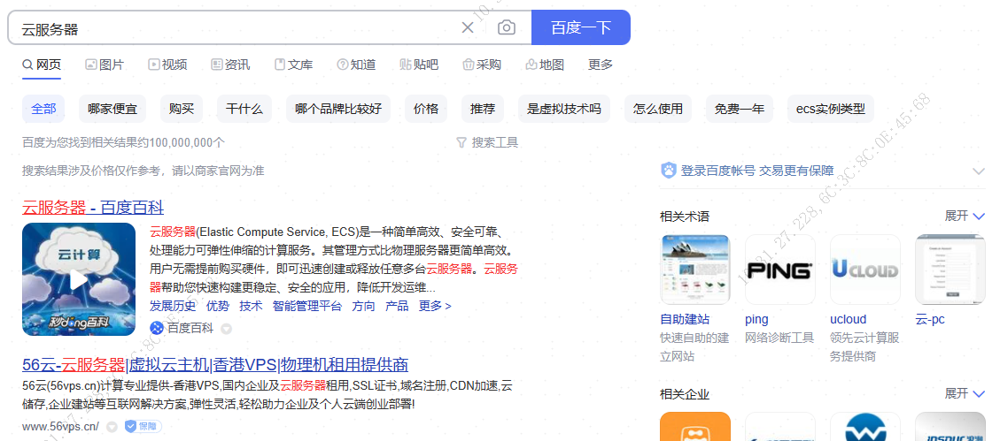
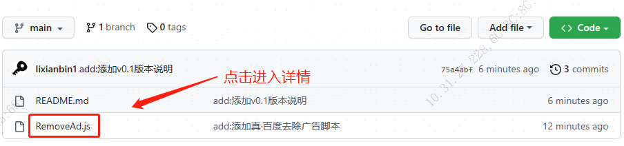

# Tampermonkey

自定义油猴脚本插件(真·去除百度广告等)

## 安装插件

请确保已先安装 [Tampermonkey](https://www.tampermonkey.net/) 脚本管理器

查看 [安装 Tampermonkey 教程](./Docs/Tampermonkey.md).

## 安装脚本

### 真·百度清除广告

说明：清除百度的顽固广告，还你一片干净土地.

👉 [点击直接安装 RemoveAd.js 脚本](https://github.com/lixianbin1/Tampermonkey/raw/main/Script/RemoveAd.user.js)

### 真·CSDN功能扩展

说明：取消网页中未登录状态不能复制的限制.

👉 [点击直接安装 RemoveAd.js 脚本](https://github.com/lixianbin1/Tampermonkey/raw/main/Script/CsdnCrx.user.js)

## 安装步骤

>如以上点击安装无效，根据以下操作进行

选中想要安装的插件，点击进入js详情页。

点击详情页左上角的`RAW` 进行插件的安装

