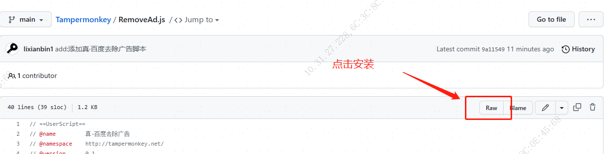

# Tampermonkey

自定义油猴脚本插件(真·去除百度广告等)

## 安装插件

请确保已先安装 [Tampermonkey](https://www.tampermonkey.net/) 脚本管理器

## 安装脚本

选中想要安装的插件，点击进入js详情页。

点击详情页左上角的`RAW` 进行插件的安装

### 真·百度清除广告

    RemoveAd.js

说明：清除百度的顽固广告，还你一片干净土地.

